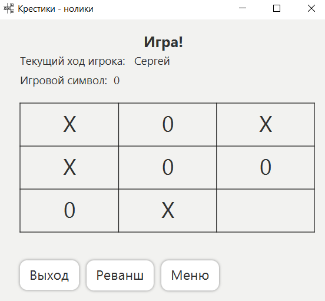

### java-TicTacToe

## Описание
Реализация популярной игры "Крестики-нолики" в виде настольного приложения.

## Технологии и инструменты
* Java core
* Maven - управление зависимостями
* Git - контроль версий
* JavaFx - графический интерфейс
* Junit 5 - тестирование

## Цель
Самостоятельный учебный проект для углубления знаний Java Core, Maven, Junit.
Изучение библиотеки JavaFx.

## Функционал
Приложение позволяет играть в "Крестики-нолики" против другого игрока. При настройке
 игры следует ввести имена двух игроков. Ввод подтверждается Enter. Игровой символ и игрок, кто ходит первым,
определяется случайным образом перед началом игры. Во время игры, игроки, нажимая левую кнопку мыши, выбирают
ячейку в которую хотят поместить символ. Игра заканчивается, когда один из игроков поставил свои символы
в последовательный ряд. Окончание игры обозначается модальным окном с именем победителя. Ничья наступает, если 
закончились свободные клетки, но победителя нет.

В приложении реализована возможность игры против компьютера для двух уровней сложности.
На легком уровне компьютер будет ставить символ случайным образом.
Для сложного уровня реализован алгоритм для победы компьютера или ничьи в 85% случаев. 
Алгоритм стремится ходить в центр или в угловые клетки. Также, алгоритм определяет возможность игрока победить
на следующем ходу. При наличии таковой, предотвращает выигрышный ход игрока. Кроме перечисленного, алгоритм анализирует
собственные ходы, для определения выигрышной комбинации.

В приложении реализован графический интерфейс.
Реализовано тестирование.

## Запуск
1. Склонировать проект: git clone https://github.com/SergeyIv24/TicTacToe.git
2. Перейти в папку с проектом: cd TicTacToe
3. Запуск: mvn javafx:run

## Демонстрация функционала

Главное меню:

Главное меню, несколько уровней сложности:

Настройка игры против другого игрока:

Игра против игрока:

Настройка игры против компьютера:

Игра против компьютера:
